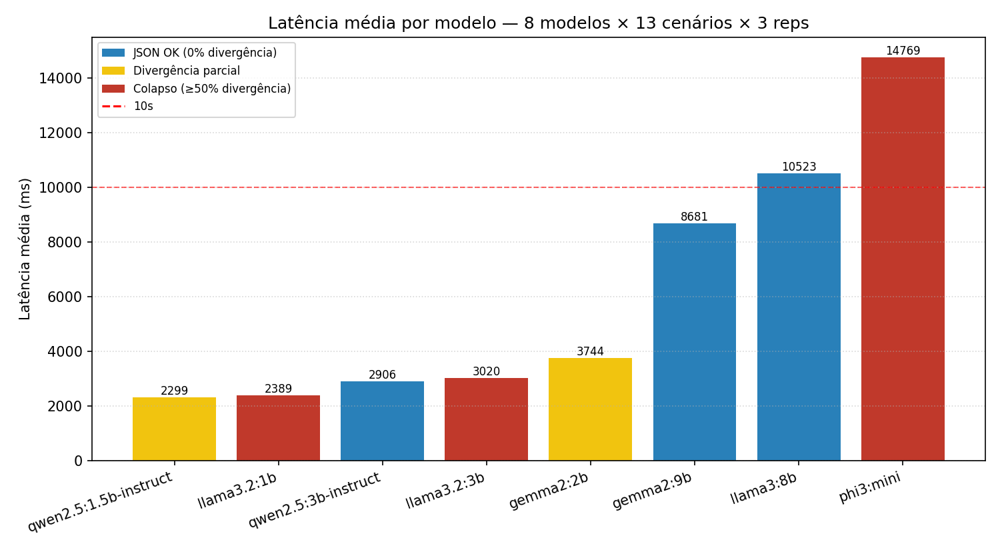
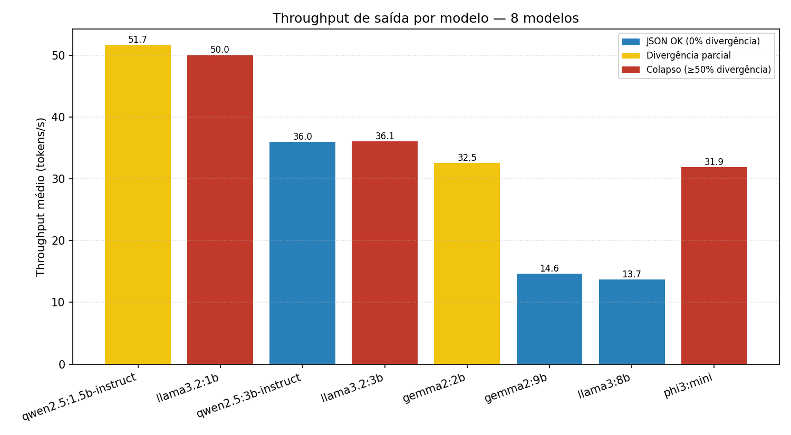
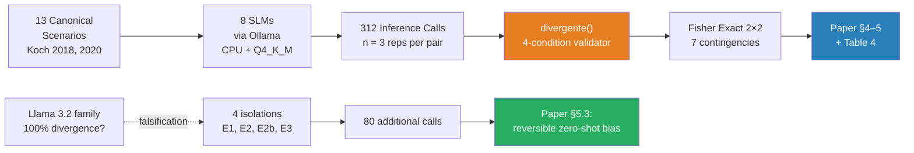
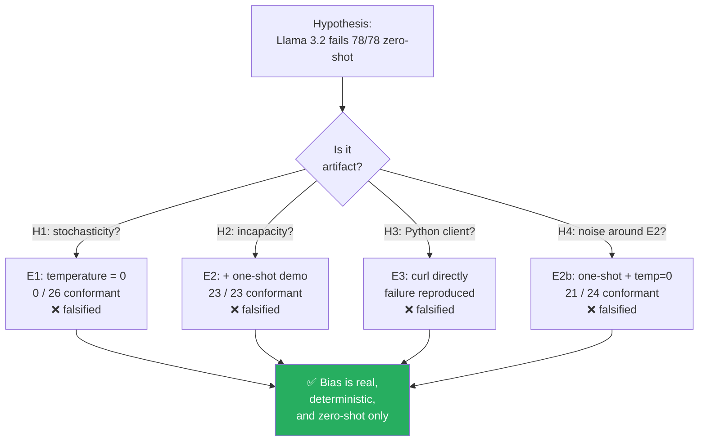

# A Diagnostic Evaluation of Small Language Models for Offline Socratic Tutoring in Brazilian Portuguese

🇧🇷 **[Versão em Português →](README.pt-br.md)**

[](paper/artigo_benchmark_slm.pdf)
[](paper/artigo_benchmark_slm.docx)
[](https://www.python.org)
[](https://ollama.com)
[](LICENSE)
[](LICENSE-DATA)
[]()
[]()

> Diagnostic benchmark of 8 open Small Language Models (≤ 3.8 B parameters) for
> Socratic tutoring of writing in Brazilian Portuguese, evaluated strictly offline
> on CPU, against a metalinguistic rubric derived from Koch's Textual Linguistics.
> Includes a four-isolation falsification protocol that reclassifies the Llama 3.2
> family failure as a **reversible zero-shot bias** rather than compositional
> incapacity, supported by Fisher's exact tests on 2×2 conformance contingencies.

📄 Read the full paper: [PDF](paper/artigo_benchmark_slm.pdf) · [DOCX](paper/artigo_benchmark_slm.docx) · [Markdown source](paper/artigo_benchmark_slm.md) · 🌐 [Interactive report](report/index.html)

---

## TL;DR — the central finding at a glance

<table>
<tr>
<td width="50%">

**Structural conformance under zero-shot**

| Tier | Models |
|---|---|
| 🟢 Conformant (≤ 2.6 % divergence) | `qwen2.5:3b-instruct`<br>`qwen2.5:1.5b-instruct`<br>`gemma2:2b`<br>`gemma2:9b` *(ceiling)*<br>`llama3:8b` *(ceiling)* |
| 🔴 Divergent (100 %) | `llama3.2:1b`<br>`llama3.2:3b`<br>`phi3:mini` |

</td>
<td width="50%">

**Recovery under one-shot demonstration**

| Model | Zero-shot | One-shot |
|---|---:|---:|
| `llama3.2:3b` | 0 / 39 | **12 / 12** |
| `llama3.2:1b` | 0 / 39 | **11 / 11** |

Fisher exact for both: ***p* < 10⁻¹¹**

The Llama 3.2 family is *capable* — its zero-shot disobedience is a reversible post-training bias, not architectural incapacity.

</td>
</tr>
</table>

---

## Latency vs. structural conformance



Latency averages, ordered ascending. Bar color encodes structural conformance under
zero-shot: 🔵 zero divergence, 🟡 partial divergence, 🔴 collapse (≥ 50 %). The red
dashed line marks the **10 s threshold** for synchronous classroom UX (Nielsen, 1993).



---

## Experimental pipeline



---

## How the failure was falsified



---

## Reproduce in four commands

Requires Python 3.11+, [Ollama](https://ollama.com) installed locally, and ~8 GB of RAM
(plus disk space for model weights — about 30 GB for the full 8-model set).

```bash
# 1) Pull all eight models locally
ollama pull qwen2.5:1.5b-instruct qwen2.5:3b-instruct \
            llama3.2:1b llama3.2:3b \
            gemma2:2b gemma2:9b \
            llama3:8b phi3:mini

# 2) Install Python dependencies
pip install -r requirements.txt

# 3) Run the main benchmark (8 models × 13 scenarios × 3 reps = 312 calls)
python src/benchmark_local.py

# 4) Reproduce the inferential analysis (Fisher exact on 7 contingencies)
python src/inferential_statistics.py
```

For the falsification protocol on the Llama 3.2 family (4 isolations, 80 calls):

```bash
python src/counter_experiment_llama32.py
```

---

## Repository layout

```
.
├── paper/                          # The article in three formats
│   ├── artigo_benchmark_slm.md     # Markdown source (canonical)
│   ├── artigo_benchmark_slm.pdf    # PDF for screen reading
│   ├── artigo_benchmark_slm.docx   # DOCX for Word review
│   ├── md_to_pdf.py                # PDF generator (reportlab)
│   ├── md_to_docx.py               # DOCX generator (textutil + markdown)
│   └── references_inventory.txt    # Raw literature inventory
│
├── src/                            # All Python sources
│   ├── benchmark_local.py          # Main collection driver
│   ├── counter_experiment_llama32.py   # Falsification protocol (E1, E2, E2b)
│   ├── mine_benchmark.py           # Raw JSON → flat CSV extractor
│   ├── summarize_consolidated.py   # Aggregated table + figures
│   ├── generate_final_report.py    # Human-readable report
│   ├── inferential_statistics.py   # Fisher exact tests
│   └── prompts.py                  # Canonical SYSTEM_PROMPT (verbatim)
│
├── data/
│   ├── scenarios_canonical_koch.jsonl    # 13 canonical scenarios
│   ├── human_readable_report.txt         # English summary
│   └── results/
│       ├── round_1_main_models.json
│       ├── round_2_complementary_models.json
│       ├── counter_experiment_llama32.json
│       └── counter_experiment_llama32.log
│
├── analises/                       # Generated artifacts
│   ├── benchmark_flat.csv
│   ├── inferential_results.json
│   ├── latencia_media.png
│   └── throughput_tokens.png
│
└── report/                         # Interactive HTML report
    └── index.html                  # Self-contained, no dependencies
```

---

## Methodology in one paragraph

Inference is conducted strictly locally and offline against an [Ollama](https://ollama.com)
server, over CPU with no GPU acceleration, in `Q4_K_M` quantization — emulating
the computational ceiling of typical Brazilian public-school computer labs.
Each model receives the same canonical SYSTEM_PROMPT and the same 13 canonical
scenarios drafted by a Textual Linguistics specialist. Conformance is decided
by a deterministic four-condition validator (`divergente()` in
[`src/mine_benchmark.py`](src/mine_benchmark.py)); categorical comparisons are
supported by Fisher's exact test. No grammar coercion, regex validation, or
constrained decoding is applied — only the model's native instruction-following
is measured. Full details are in Section 3 of the paper.

---

## A note on the SYSTEM_PROMPT identifier

The literal SYSTEM_PROMPT used across all 312 + 76 inference calls is preserved
verbatim in [`src/prompts.py`](src/prompts.py) for reproducibility. The prompt
opens with `"Você é o Bento..."` — *Bento* is the internal working identifier
of a future pedagogical fine-tuned model planned by the author, not part of the
public nomenclature of this benchmark. Renaming the prompt post-hoc would
invalidate reproducibility of the collected dataset, and a re-run would produce
a numerically different (though qualitatively identical) result. The choice
here, deliberate, is to preserve the historical artifact as it was.

---

## How to cite

If you use this benchmark, dataset, or methodology, please cite:

```bibtex
@article{reboucas2026slmsocratic,
  title   = {A Diagnostic Evaluation of Small Language Models for Offline
             Socratic Tutoring in Brazilian Portuguese: A Study on Structural
             and Pedagogical Adherence under Public-School Infrastructure Constraints},
  author  = {Reb{\'o}u{\c{c}}as, Randerson Oliveira Melville and Foohs, Marcelo Magalh{\~a}es},
  journal = {Preprint},
  year    = {2026},
  note    = {Available at: https://github.com/RandMelville/slm-socratic-tutor-ptbr}
}
```

A machine-readable citation file is provided in [`CITATION.cff`](CITATION.cff).

---

## Licenses

- **Source code** (`src/`, `paper/md_to_*.py`): [MIT](LICENSE)
- **Article, dataset, figures, interactive report** (`paper/`, `data/`, `analises/`, `report/`): [CC-BY 4.0](LICENSE-DATA)

---

## Authors

**Randerson Oliveira Melville Rebouças** — PhD Candidate
Graduate Program in Informatics in Education ([PPGIE](https://www.ufrgs.br/ppgie/))
Federal University of Rio Grande do Sul (UFRGS) — Porto Alegre, Brazil
`randerson.melville@gmail.com` · [ORCID: 0009-0005-3056-5074](https://orcid.org/0009-0005-3056-5074)

**Prof. Dr. Marcelo Magalhães Foohs**
Graduate Program in Informatics in Education ([PPGIE](https://www.ufrgs.br/ppgie/))
Federal University of Rio Grande do Sul (UFRGS) — Porto Alegre, Brazil
`mmfoohs@gmail.com` · [ORCID: 0000-0002-4735-0732](https://orcid.org/0000-0002-4735-0732)

Co-advisor: **Profa. Dra. Rosa Maria Vicari** (PPGIE/UFRGS) · [ORCID: 0000-0002-6909-6405](https://orcid.org/0000-0002-6909-6405)

This work was conducted with institutional support from PPGIE/UFRGS and doctoral
funding from CAPES.
