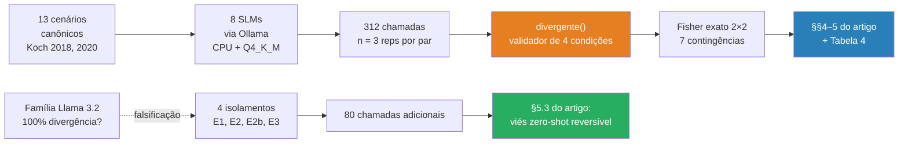
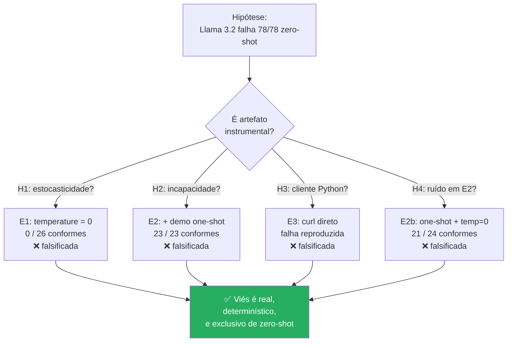

# Avaliação Diagnóstica de Modelos de Linguagem de Pequeno Porte para Tutoria Socrática Offline em Língua Portuguesa

🇺🇸 **[English version →](README.md)**

[](paper/artigo_benchmark_slm.pdf)
[](paper/artigo_benchmark_slm.docx)
[](https://www.python.org)
[](https://ollama.com)
[](LICENSE)
[](LICENSE-DATA)
[]()
[]()

> Benchmark diagnóstico de 8 Modelos de Linguagem de Pequeno Porte abertos
> (≤ 3,8 B parâmetros) para tutoria socrática de escrita em Português do Brasil,
> avaliados estritamente offline em CPU, contra rubrica metalinguística derivada
> da Linguística Textual de Ingedore Koch. Inclui protocolo de falsificação em
> quatro isolamentos que reclassifica a falha da família Llama 3.2 como **viés
> zero-shot reversível**, e não incapacidade composicional, com suporte de
> testes exatos de Fisher em contingências 2×2 de conformidade.

📄 Leia o artigo completo: [PDF](paper/artigo_benchmark_slm.pdf) · [DOCX](paper/artigo_benchmark_slm.docx) · [Markdown fonte](paper/artigo_benchmark_slm.md) · 🌐 [Relatório interativo](report/index.html)

---

## TL;DR — o achado central de relance

<table>
<tr>
<td width="50%">

**Conformidade estrutural em regime zero-shot**

| Faixa | Modelos |
|---|---|
| 🟢 Conformes (≤ 2,6 % divergência) | `qwen2.5:3b-instruct`<br>`qwen2.5:1.5b-instruct`<br>`gemma2:2b`<br>`gemma2:9b` *(teto)*<br>`llama3:8b` *(teto)* |
| 🔴 Divergentes (100 %) | `llama3.2:1b`<br>`llama3.2:3b`<br>`phi3:mini` |

</td>
<td width="50%">

**Recuperação sob demonstração one-shot**

| Modelo | Zero-shot | One-shot |
|---|---:|---:|
| `llama3.2:3b` | 0 / 39 | **12 / 12** |
| `llama3.2:1b` | 0 / 39 | **11 / 11** |

Fisher exato em ambos: ***p* < 10⁻¹¹**

A família Llama 3.2 é *capaz* — sua desobediência zero-shot é viés reversível de pós-treinamento, não incapacidade arquitetural.

</td>
</tr>
</table>

---

## Latência vs. conformidade estrutural


Latência média por modelo, em ordem crescente. A cor da barra codifica
conformidade estrutural em zero-shot: 🔵 sem divergência, 🟡 divergência parcial,
🔴 colapso (≥ 50 %). A linha vermelha tracejada marca o **limiar de 10 s** para
UX síncrona em sala (Nielsen, 1993).


---

## Pipeline experimental



---

## Como a falha foi falsificada



---

## Reproduzir em quatro comandos

Requer Python 3.11+, [Ollama](https://ollama.com) instalado localmente, e ~8 GB de RAM
(mais espaço em disco para os pesos dos modelos — cerca de 30 GB para os 8 modelos).

```bash
# 1) Baixa os oito modelos localmente
ollama pull qwen2.5:1.5b-instruct qwen2.5:3b-instruct \
            llama3.2:1b llama3.2:3b \
            gemma2:2b gemma2:9b \
            llama3:8b phi3:mini

# 2) Instala as dependências Python
pip install -r requirements.txt

# 3) Executa o benchmark principal (8 modelos × 13 cenários × 3 reps = 312 chamadas)
python src/benchmark_local.py

# 4) Reproduz a análise inferencial (Fisher exato em 7 contingências)
python src/inferential_statistics.py
```

Para o protocolo de falsificação da família Llama 3.2 (4 isolamentos, 80 chamadas):

```bash
python src/counter_experiment_llama32.py
```

---

## Estrutura do repositório

```
.
├── paper/                          # O artigo em três formatos
│   ├── artigo_benchmark_slm.md     # Markdown fonte (canônico)
│   ├── artigo_benchmark_slm.pdf    # PDF para leitura em tela
│   ├── artigo_benchmark_slm.docx   # DOCX para revisão no Word
│   ├── md_to_pdf.py                # Gerador de PDF (reportlab)
│   ├── md_to_docx.py               # Gerador de DOCX (textutil + markdown)
│   └── references_inventory.txt    # Inventário bruto de referências
│
├── src/                            # Todos os scripts Python
│   ├── benchmark_local.py          # Driver principal da coleta
│   ├── counter_experiment_llama32.py   # Protocolo de falsificação (E1, E2, E2b)
│   ├── mine_benchmark.py           # JSON bruto → CSV plano
│   ├── summarize_consolidated.py   # Tabela agregada + figuras
│   ├── generate_final_report.py    # Relatório legível por humano
│   ├── inferential_statistics.py   # Testes exatos de Fisher
│   └── prompts.py                  # SYSTEM_PROMPT canônico (verbatim)
│
├── data/
│   ├── scenarios_canonical_koch.jsonl    # 13 cenários canônicos
│   ├── human_readable_report.txt         # Resumo em inglês
│   └── results/
│       ├── round_1_main_models.json
│       ├── round_2_complementary_models.json
│       ├── counter_experiment_llama32.json
│       └── counter_experiment_llama32.log
│
├── analises/                       # Artefatos gerados
│   ├── benchmark_flat.csv
│   ├── inferential_results.json
│   ├── latencia_media.png
│   └── throughput_tokens.png
│
└── report/                         # Relatório HTML interativo
    └── index.html                  # Auto-contido, sem dependências
```

---

## Metodologia em um parágrafo

A inferência é conduzida estritamente local e offline contra um servidor
[Ollama](https://ollama.com), sobre CPU sem aceleração de GPU, em quantização
`Q4_K_M` — emulando o teto computacional típico de laboratórios de informática
de escolas públicas brasileiras. Cada modelo recebe o mesmo SYSTEM_PROMPT
canônico e os mesmos 13 cenários canônicos redigidos por especialista em
Linguística Textual. A conformidade é decidida por validador determinístico de
quatro condições (`divergente()` em [`src/mine_benchmark.py`](src/mine_benchmark.py));
comparações categóricas são apoiadas pelo teste exato de Fisher. Não há coerção
gramatical, validação por regex, nem decodificação restrita — apenas a aderência
nativa do modelo à instrução é medida. Detalhes completos na Seção 3 do artigo.

---

## Nota sobre o identificador no SYSTEM_PROMPT

O SYSTEM_PROMPT literal utilizado nas 312 + 76 chamadas de inferência é preservado
verbatim em [`src/prompts.py`](src/prompts.py) para fins de reprodutibilidade. O
prompt começa com `"Você é o Bento..."` — *Bento* é o identificador interno de
trabalho de um modelo planejado de ajuste fino pedagógico do autor, não parte da
nomenclatura pública deste benchmark. Renomear o prompt post-hoc invalidaria a
reprodutibilidade do dataset coletado, e uma nova execução produziria resultado
numericamente diferente (embora qualitativamente idêntico). A escolha aqui, deliberada,
é preservar o artefato histórico como ele foi.

---

## Como citar

Se você usar este benchmark, dataset ou metodologia, por favor cite:

```bibtex
@article{reboucas2026slmsocratic,
  title   = {A Diagnostic Evaluation of Small Language Models for Offline
             Socratic Tutoring in Brazilian Portuguese: A Study on Structural
             and Pedagogical Adherence under Public-School Infrastructure Constraints},
  author  = {Reb{\'o}u{\c{c}}as, Randerson Oliveira Melville},
  journal = {Preprint},
  year    = {2026},
  note    = {Disponível em: https://github.com/RandMelville/slm-socratic-tutor-ptbr}
}
```

Um arquivo de citação legível por máquina está disponível em [`CITATION.cff`](CITATION.cff).

---

## Licenças

- **Código-fonte** (`src/`, `paper/md_to_*.py`): [MIT](LICENSE)
- **Artigo, dataset, figuras, relatório interativo** (`paper/`, `data/`, `analises/`, `report/`): [CC-BY 4.0](LICENSE-DATA)

---

## Autor

**Randerson Oliveira Melville Rebouças** — Doutorando
Programa de Pós-Graduação em Informática na Educação ([PPGIE](https://www.ufrgs.br/ppgie/))
Universidade Federal do Rio Grande do Sul (UFRGS) — Porto Alegre, Brasil
`randerson.melville@gmail.com`

Orientador: **Prof. Dr. Marcelo Magalhães Foohs** (PPGIE/UFRGS)
Coorientadora: **Profa. Dra. Rosa Maria Vicari** (PPGIE/UFRGS)

Este trabalho foi conduzido com apoio institucional do PPGIE/UFRGS e financiamento
de bolsa de doutorado da CAPES.
